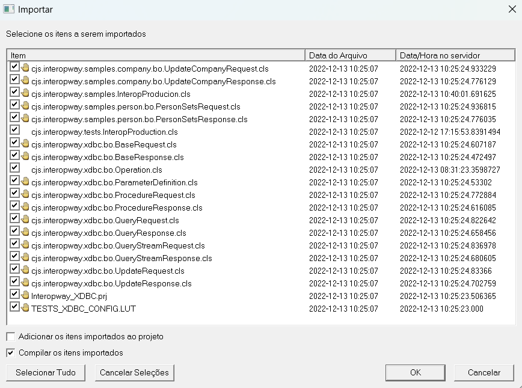
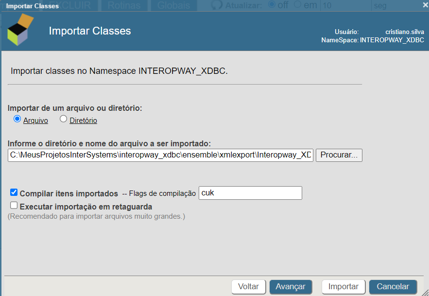
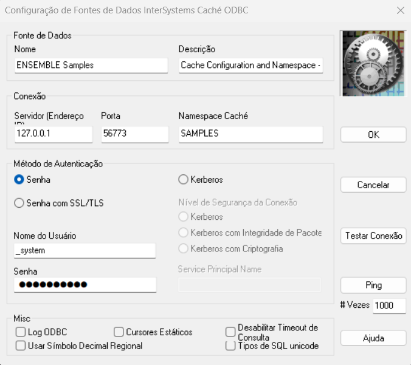
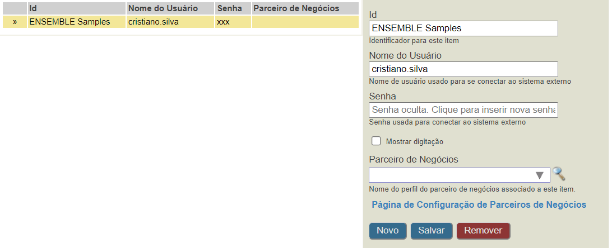
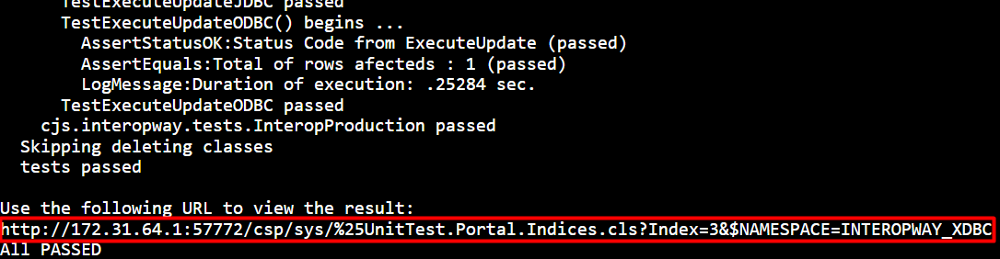

[Português Brasil](/README.pt-br.md)
---
# Interopway

<p align="center">
  
</p>

This project aims to provide a framework to assist in the development of interoperability projects using [InterSystems](https://www.intersystems.com) technologies, such as:

- [Ensemble](https://docs.intersystems.com/latest/csp/docbook/DocBook.UI.Page.cls)
- [IRIS Data Platform](https://docs.intersystems.com/irislatest/csp/docbook/DocBook.UI.Page.cls)
- [IRIS for Health](https://docs.intersystems.com/irisforhealthlatest/csp/docbook/DocBook.UI.Page.cls)
- [HealthShare Health Connect](https://docs.intersystems.com/healthconnectlatest/csp/docbook/DocBook.UI.Page.cls)

The main goal is to encapsulate all repetitive development into configurable components.

## Protocols and Technologies

In this first version, the **XDBC** module is available for developing interoperability with access to relational databases. This module can be used in Ensemble, IRIS, IRIS for Health and Health Connect.

All collaborations are welcome. Feel free to fork the repository and contribute.

## XDBC

This module aims to streamline the development of interoperability using **ODBC** or **JDBC**. Installation is quite simple. Download the xml package [Interopway_XDBC-V0.0.1.xml](/xmlexport/Interopway_XDBC.xml) and import it into the desired namespace.

The import can be done in 3 ways:

1. [Via Studio](https://docs.intersystems.com/ens201815/csp/docbook/DocBook.UI.Page.cls?KEY=GSTD_Commands#GSTD_Commands_Tools) (Windows only);

<p style='text-align: justify;'>
  
</p>

2. [Via SMP](https://docs.intersystems.com/ens201815ImportacaoClassesStudio.png/csp/docbook/DocBook.UI.Page.cls?KEY=ACLS#ACLS_import) (any SO);

<p style='text-align: justify;'>
  
</p>

3. Terminal or [WebTerminal](https://intersystems-community.github.io/webterminal/) (any SO)

```objectscript
Do $system.OBJ.Load("</file/path>/Interopway_XDBC-V0.0.1.xml","ck")
```

Usage is easy and almost self-explanatory. In the package [cjs.interopway.samples](/src/cjs/interopway/samples/) there is a [Production](cjs/interopway/samples/InteropProduction.cls) configured demonstrating the use of **ODBC** and ** interoperability JDBC**.

The class [cjs.interopway.tests.InteropProduction](/src/cjs/interopway/tests/InteropProduction.cls) with the test cases to be executed to validate the installation.

Below are detailed the prerequisites and necessary steps for the execution of the test cases. The tests were performed in a Windows environment on an Ensemble instance:

$ZV=Cache for Windows (x86-64) 2018.1.5 (Build 659U) Mon Mar 22 2021 07:03:57 EDT

## Prerequisites to run the test cases:

- JDK 1.7 or 1.8 installed. Used by the **JDBC** connection;


- Systems DSN named *Ensemble Samples* used by **ODBC** connection;
<p style='text-align: justify;'>
   
</p>

- Empty directory *C:\Temp\tests*. Used by Test Manager;


- [Credential](https://docs.intersystems.com/ens201815/csp/docbook/DocBook.UI.Page.cls?KEY=ECONFIG_reusable#ECONFIG_reusable_credentials) *Ensemble Samples* configured in SMP in the installation namespace.

<p style='text-align: justify;'>
   
</p>

## Execution of Test Cases

Once the prerequisites are met open a Terminal or [WebTerminal](https://intersystems-community.github.io/webterminal/) session in the namespace where the XDBC module was installed and run the line below:

```objectscript
Do ##Class(%UnitTest.Manager).RunTest("tests:cjs.interopway.tests.InteropProduction", "/noload/nodelete")
```

At the end of running the tests, if everything went as expected, the output should look something like the image below. For a detailed execution report, access the URL that appears in the image highlight.

<p style='text-align: justify;'>
  
</p>

The URL will take you to the Test Portal where you can inspect each test case individually.


Test Case execution detail *TestExecuteProcedureODBC*


## Understand Sample Code and Tests

We will detail the use of the *Lookup Table* [TESTS_XDBC_CONFIG](/src/TESTS_XDBC_CONFIG.LUT) and the classes of the example package [cjs.interopway.samples](/src/cjs/interopway/samples):

0. [TESTS_XDBC_CONFIG](/src/TESTS_XDBC_CONFIG.LUT) - Lookup Table with the necessary configurations for the execution of SQL commands to be executed in external databases.

	```xml
	<?xml version="1.0"?>
	<lookupTable>
		<entry table="TESTS_XDBC_CONFIG" key="cjs.interopway.samples.company.bo.UpdateCompanyRequest">{
			"credential":"ENSEMBLE Samples",
			"statement":"UPDATE Sample.Company SET TaxID = ? WHERE ID = ?"
		}
		</entry>
		<entry table="TESTS_XDBC_CONFIG" key="cjs.interopway.samples.person.bo.PersonSetsRequest">{
			"credential":"ENSEMBLE Samples",
			"statement":"? = CALL Sample.PersonSets(?,?)"
		}
		</entry>
		<entry table="TESTS_XDBC_CONFIG" key="cjs.interopway.xdbc.bo.QueryRequest">{
			"credential":"ENSEMBLE Samples",
			"statement":"SELECT * FROM Sample.Person"
		}
		</entry>
		<entry table="TESTS_XDBC_CONFIG" key="cjs.interopway.xdbc.bo.QueryStreamRequest">{
			"credential":"ENSEMBLE Samples",	
			"statement":"SELECT * FROM Sample.Employee"
		}
		</entry>
	</lookupTable>
	```

The Lookup Table above is used by all classes that appear in the *key* attribute of the lookup, more specifically in the constructor that is defined in the base class of the request [cjs.interopway.xdbc.bo.BaseRequest](/src/cjs/interopway/ xdbc/bo/BaseRequest.cls):

  ```objectscript
  Method %OnNew(lookupTable As %String = "XDBC") As %Status
  {
  	#Dim exception	As %Exception.General = ""
  	#Dim statusCode	As %Status            = $System.Status.OK()
  	Try 
  	{
  		#Dim configString	As %String = ##Class(Ens.Util.FunctionSet).Lookup(lookupTable, $ClassName())
  		If (configString = "")
  		{
  			Return statusCode
  		}
  		#Dim config As %DynamicObject = {}.%FromJSON(configString)
  		If (config.credential '= "" && '##Class(Ens.Config.Credentials).%ExistsId(config.credential))
  		{
  			Return $System.Status.Error(5001, "Credential does not exists.")
  		}
  		If (config.credential '= "")
  		{
  			Set ..Credential	= config.credential
  		}
  		If (config.statement '= "")
  		{
  			Set ..Statement	= config.statement
  		}
  		If (config.dsn '= "")
  		{
  			Set ..DSN	= config.dsn
  		}				
  	}
  	Catch (exception) 
  	{
  		Set statusCode = exception.AsStatus()
  	}
  	Return statusCode
  }
  ```

1. [cjs.interopway.samples.company.bo.UpdateCompanyRequest](/src/cjs/interopway/samples/company/bo/UpdateCompanyRequest.cls) - Specific request to perform an update with parameters without describing them.

   ```objectscript
   ClassMethod GetInstance(companyId As %Integer, taxId As %String) As UpdateCompanyRequest
   {
   	#Dim updateRequest			As UpdateCompanyRequest	= ..%New("TESTS_XDBC_CONFIG")
   	//	
   	Do updateRequest.Parameters.Insert(##Class(ParameterDefinition).%New(1, taxId))
   	Do updateRequest.Parameters.Insert(##Class(ParameterDefinition).%New(2, companyId))
   	//
   	Return updateRequest
   }
   ```

2. [cjs.interopway.samples.person.bo.PersonSetsRequest](/src/cjs/interopway/samples/person/bo/PersonSetsRequest.cls) - Specific request to execute the procedure that returns 2 *ResultsSets* and describes the parameters of the call.

   ```objectscript
   ClassMethod GetInstance(name As %Integer, state As %String) As PersonSetsRequest
   {
   	#Dim procedureRequest	As UpdateCompanyRequest	= ..%New("TESTS_XDBC_CONFIG")	
   	#Dim returnParameter	As ParameterDefinition	= ##Class(ParameterDefinition).%New(1)
   	#Dim nameParameter		As ParameterDefinition	= ##Class(ParameterDefinition).%New(2, name)
   	#Dim stateParameter		As ParameterDefinition	= ##Class(ParameterDefinition).%New(3, state)
   	//
   	Set returnParameter.IOType	= returnParameter.IOTypeDisplayToLogical("OUTPUT")
   	Set nameParameter.IOType		= nameParameter.IOTypeDisplayToLogical("INPUT")
   	Set stateParameter.IOType		= stateParameter.IOTypeDisplayToLogical("INPUT")
   	Set returnParameter.SqlType	= $$$SqlInteger
   	Set nameParameter.SqlType		= $$$SqlVarchar
   	Set stateParameter.SqlType	= $$$SqlVarchar
   	//
   	Do procedureRequest.Parameters.Insert(returnParameter)
   	Do procedureRequest.Parameters.Insert(nameParameter)
   	Do procedureRequest.Parameters.Insert(stateParameter)
   	//
   	Return procedureRequest
   }
   ```

3. [cjs.interopway.samples.InteropProducion.cls](/src/cjs/interopway/samples/InteropProducion.cls) - Example Production class containing the components:

- *EnsLib.JavaGateway.Service* - Busines Service that communicates with the JVM. The path for the JDBC drivers of the external database must be configured.


- *JDBC Sample Operation* - Instance of the class [cjs.interopway.xdbc.bo.Operation](/src/cjs/interopway/xdbc/bo/Operation.cls). Business Operation that communicates with the exteran database via **JDBC**. Here the DSN is configured, which in this case is the connection String, Credential and driver class


- *ODBC Sample Operation* - Instance of the class [cjs.interopway.xdbc.bo.Operation](/src/cjs/interopway/xdbc/bo/Operation.cls). Business Operation that communicates with the exteran database via **ODBC**. Here the DSN and Credential are configured.


The package [cjs.interopway.tests](/src/cjs/interopway/tests) is detailed below:

4. [cjs.interopway.tests.InteropProduction](/src/cjs/interopway/tests/InteropProduction.cls) - Class with the test cases to be executed:

    - *TestExecuteQueryODBC* - Executes the SQL command *SELECT * FROM Sample.Person* on the ODBC connection.

    - *TestExecuteQueryJDBC* - Executes the SQL command *SELECT * FROM Sample.Person* on the JDBC connection.

    - *TestExecuteQueryStreamODBC* - Executes the SQL command *SELECT * FROM Sample.Employee* on the ODBC connection.

    - *TestExecuteQueryStreamODBC* - Executes the SQL command *SELECT * FROM Sample.Employee* on the JDBC connection.

    - *TestExecuteUpdateODBC* - Execute SQL command *UPDATE Sample.Company SET TaxID = ? WHERE ID = ?* in the ODBC connection with parameters however you describe them.

    - *TestExecuteUpdateJDBC* - Execute the SQL command *UPDATE Sample.Company SET TaxID = ? WHERE ID = ?* in JDBC connection with parameters but if you describe them

    - *TestExecuteProcedureODBC* - Execute SQL command *? = CALL Sample.PersonSets(?,?)* on the JDBC connection with parameters and describing them.

    - *TestExecuteProcedureODBC* - Execute SQL command *? = CALL Sample.PersonSets(?,?)* on the JDBC connection with parameters and describing them.

## Basic Usage Guide

To use interopway_xdbc, just follow the simple guide below:

- Add the Busines Operation [(cjs.interopway.xdbc.bo.Operation](/src/cjs/interopway/xdbc/bo/Operation.cls) to Production;

- When using a connection via **ODBC**, configure the *DSN* in ht Operating System;

- When using a **JDBC** connection, add the driver's path to *CLASSPATH*;

- According to the need, you can configure the *Credential* and/or *DSN* in the Business Operation settings.

- If the *Credential* and/or *DSN* are not configured in the Business Operation, these settings must be passed to the Business Operation through the request messages, and can be assigned directly to the message, or can be added to the *Lookup Table* used in the message constructor. See: [cjs.interopway.xdbc.bo.BaseRequest](/src/cjs/interopway/xdbc/bo/BaseRequest.cls)

- For the vast majority of databases, SQL commands that have parameters, it is not necessary to describe them through the properties *SQLType*, *Precision* and *Scale* of the class [cjs.interopway.xdbc.bo.ParameterDefinition](/src/cjs/interopway/xdbc/bo/ParameterDefinition.cls). See: [cjs.interopway.samples.company.bo.UpdateCompanyRequest](/src/cjs/interopway/samples/company/bo/UpdateCompanyRequest.cls);

## DOCKER Support
### Prerequisites   
Make sure you have [git](https://git-scm.com/book/en/v2/Getting-Started-Installing-Git) and [Docker desktop](https://www.docker.com/products/docker-desktop) installed.    
### Installation    
Clone/git pull the repo into any local directory
```
$ git clone https://github.com/cristianojs/interopway.git
```
Open the terminal in this directory and run:
```
$ docker-compose build
```
Run IRIS container with your project:
```
$ docker-compose up -d
```
Test from docker console
```
$ docker-compose exec iris1 iris session iris
USER>
```
or using **WebTerminal**
```
http://localhost:42773/terminal/
```
